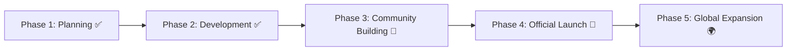

# 🕰️ Project LJM Clockwork
> **Digital Heritage Archiving on Blockchain**  
> Preserving humanity's precious records as permanent digital assets through blockchain technology


---

## 📖 About The Project

**Project LJM Clockwork** is a revolutionary blockchain-based platform that transforms socially valuable records and heritage into permanent digital assets (NFTs). We leverage cutting-edge technology to create a sustainable ecosystem where cultural preservation meets modern innovation.

### 🎯 Mission
To establish a digital legacy ecosystem that permanently preserves humanity's precious records and heritage as digital assets, creating new forms of cultural and social value.

### ✨ Key Features
- **🔒 Permanent Preservation**: Immutable blockchain storage
- **🌍 Global Accessibility**: Democratized access to digital heritage
- **💎 NFT Ecosystem**: 5,800 unique digital assets across 4 tiers
- **⌚ Smart Integration**: Smartwatch faces via Google Play Store
- **🏛️ Governance**: Community-driven decision making

---

## 🪙 LOH Token

<table>
<tr>
<td width="50%">

### 📊 Token Information
- **Name**: Lee Jae-myung One Hour (LOH)
- **Symbol**: LOH  
- **Total Supply**: 51,169,148 LOH
- **Decimals**: 18
- **Network**: Polygon (ERC-20)
- **Contract**: `[Contract Address]`

</td>
<td width="50%">

### 🚀 Live Trading
- **QuickSwap**: [Trade LOH](https://quickswap.exchange) ✅
- **Price**: $[Current Price]
- **Liquidity**: $1,000+ 
- **24h Volume**: $[Volume]

</td>
</tr>
</table>

### 💡 Token Utilities

| Feature | Description |
|---------|-------------|
| 🗳️ **Governance** | 1 LOH = 1 vote in project decisions |
| 🔒 **Staking** | Earn 5-12% APY rewards |
| 🎫 **Access Rights** | Tier-based NFT purchasing privileges |
| 💰 **Fee Payment** | Platform transaction fees |
| 🔥 **Deflationary** | 50% of fees automatically burned |

---

## 🏗️ Architecture

### Smart Contract Features
```solidity
contract LOHToken is ERC20, Ownable, Pausable {
    // Governance System
    function propose() external;
    function vote(uint256 proposalId, bool support) external;
    
    // Staking Mechanism  
    function stake(uint256 amount) external;
    function unstake(uint256 amount) external;
    
    // Access Control
    function getUserTier(address user) external view returns (TierLevel);
}
```

### 🎨 NFT Tiers
- **LEGENDARY** (1): Ultimate rarity with exclusive privileges
- **EPIC** (99): High-value heritage for contributors  
- **RARE** (700): Limited edition unique assets
- **COMMON** (5,000): Free smartwatch faces on Google Play

---

## 📄 Documentation

| Document | Language | Link |
|----------|----------|------|
| 📋 **Whitepaper** | English | [📖 Read](docs/whitepaper-en.md) |
| 📋 **백서** | 한국어 | [📖 읽기](docs/whitepaper-ko.md) |
| 🔧 **Technical Specs** | English | [📖 View](docs/technical-specs.md) |
| 👥 **Team Profiles** | Bilingual | [📖 Meet the Team](docs/team-profiles.md) |

---

## 👥 Team

<table>
<tr>
<td align="center" width="14.28%">
<br>
<b>김경구 (Cocoon)</b><br>
<sub>Founder / Project Lead</sub><br>
<a href="https://linkedin.com/in/wakk5252">LinkedIn</a>
</td>
<td align="center" width="14.28%">
<br>
<b>조대연</b><br>
<sub>Legal Counsel</sub><br>
<sub>Ex-Samsung Electronics</sub>
</td>
<td align="center" width="14.28%">
<br>
<b>양찬우</b><br>
<sub>Developer</sub><br>
<sub>Ex-Coupang IT Manager</sub>
</td>
<td align="center" width="14.28%">
<br>
<b>김영권 (honuy)</b><br>
<sub>Dev Team Lead</sub><br>
<sub>Ex-Hi-mart IT Manager</sub>
</td>
<td align="center" width="14.28%">
<br>
<b>김지우 (pony)</b><br>
<sub>Design Lead</sub><br>
<sub>Intl. Design School</sub>
</td>
<td align="center" width="14.28%">
<br>
<b>최우정</b><br>
<sub>Strategy Director</sub><br>
<sub>Ex-MultiBank CEO</sub>
</td>
<td align="center" width="14.28%">
<br>
<b>박영찬 (solchni)</b><br>
<sub>Manager</sub><br>
<sub>Professional Trader</sub>
</td>
</tr>
</table>

**🤖 Technical Advisory**: ChatGPT (OpenAI Language Model)

---

## 🗺️ Roadmap



| Phase | Status | Milestones |
|-------|--------|------------|
| **Phase 1** | ✅ Complete | Planning & Technical Validation |
| **Phase 2** | ✅ Complete | Platform Development & NFT Creation |
| **Phase 3** | 🔄 In Progress | Community Building & **QuickSwap Listing** |
| **Phase 4** | 📅 2025 Q3-Q4 | Official Launch & Ecosystem Expansion |
| **Phase 5** | 📅 2025 Q4-2026 | Global Expansion & Cross-chain Integration |

---

## 🚀 Quick Start

### For Traders
1. **Get LOH**: Trade on [QuickSwap](https://quickswap.exchange)
2. **Add to Wallet**: Import contract address to MetaMask
3. **Join Community**: [Telegram](https://t.me/YesOkLab_NFT)

### For Developers
1. **Clone Repository**: `git clone [repo-url]`
2. **Read Technical Docs**: [docs/technical-specs.md](docs/technical-specs.md)
3. **Review Contracts**: [contracts/](contracts/)
4. **Contribute**: Submit issues and PRs welcome!

### For Investors
1. **Read Whitepaper**: [English](docs/whitepaper-en.md) | [한국어](docs/whitepaper-ko.md)
2. **Check Tokenomics**: Detailed distribution plan included
3. **Meet the Team**: [Team Profiles](docs/team-profiles.md)
4. **Contact Us**: YesOkLab@gmail.com

---

## 🔗 Links & Social

<div align="center">

[](https://www.ljmsider.com)
[](https://t.me/YesOkLab_NFT)
[](https://x.com/YesOkLab)
[](https://naver.me/5TQSW1qE)

[](https://quickswap.exchange)
[](https://polygon.technology)

</div>

---

## 📊 Statistics

<div align="center">


**Total Supply**: 51,169,148 LOH | **Market Cap**: $[Market Cap] | **Holders**: [Holder Count]+

</div>

---

## 🤝 Contributing

We welcome contributions from the community! Please read our [Contributing Guidelines](CONTRIBUTING.md) before submitting any PRs.

### Ways to Contribute
- 📝 Documentation improvements
- 🐛 Bug reports and fixes
- 💡 Feature suggestions
- 🌍 Translations
- 🎨 Design improvements

---

## 📜 License

This project is licensed under the MIT License - see the [LICENSE](LICENSE) file for details.

---

## ⚠️ Disclaimer

*This project involves cryptocurrency and blockchain technology. Please do your own research (DYOR) before making any investment decisions. Cryptocurrency investments carry inherent risks.*

---

<div align="center">

**🕰️ Preserving Today's Heritage for Tomorrow's Generations 🕰️**

*Made with ❤️ by YesOkLab Team*

</div>
